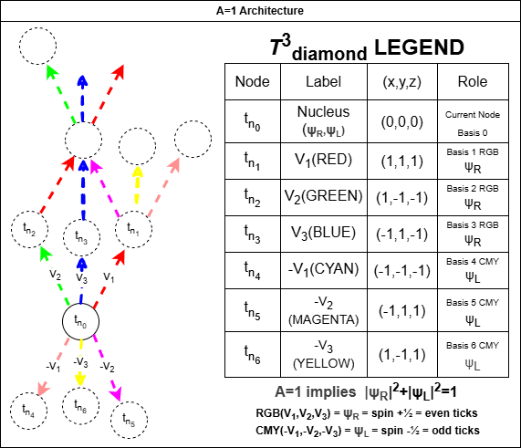

::: {.callout-note title="Statement of Intent" appearance="default"}
The A=1 discrete causal lattice is **not** proposed as the literal
microscopic structure of the universe. Instead, it is a mathematically
defined geometric object whose intrinsic constraints induce conservation
laws, symmetries, and interaction patterns reminiscent of known physics.

My research program investigates the **expressive power** of this object:
what physical structures it can encode, what symmetries it supports, and
how far its induced geometry can be pushed toward reproducing the Standard
Model and general relativity.

This is an exploration of mathematical capability, not an ontological claim.
:::

{fig-alt="Diagram of the A=1 architecture: a central nucleus node t_n0 with six labeled neighbours t_n1..t_n6 in RGB (red, green, blue) and CMY (cyan, magenta, yellow), reached by basis vectors V1, V2, V3 (and their negatives). A legend table on the right gives the (x,y,z) coordinates and spin role for each basis."}

The **A=1 Discrete Causal Lattice (DCL)** program takes a single
conservation law on a discrete-spacetime bipartite octahedral lattice
and uses it to recover emergent Lorentz invariance, locate the origin
of the Standard Model gauge group, recast gravity as a clock-density
effect, and predict a quantum analogue of the Roche limit. Successive
papers in the series advance a single methodological arc:

1. **Geometry first** ([Paper I](papers/paper-01-geometry-first.qmd)) —
   the substrate is a discrete causal lattice, and the rest follows.
2. **Geometry forces physics**
   ([Paper II](papers/paper-02-geometry-forces-physics.qmd)) — the
   Standard Model gauge group is recovered from a single conservation
   axiom, with containment established and exact equality left open.
3. **Geometry axiomatizes physics** (capstone, in progress) — the
   methodological arc is closed into a Hilbert-Sixth-shaped
   axiomatization.

This site is the public surface for the series. It tracks news,
hosts research artifacts that don't fit a paper-figure shape (3D
models, animations, interactive visualizations), and gives an
entry-point for readers, collaborators, and endorsers.

## Where to start

- **[Papers](papers/index.qmd)** — the canonical series, with Zenodo
  DOIs, arXiv links, and repository links.
- **[Research artifacts](artifacts/index.qmd)** — 3D models,
  visualizations, interactive demos.
- **[News](news/index.qmd)** — releases, deposits, talks, milestones.
- **[Essays](essays/index.qmd)** — short-form methodological writing.

## Latest news

::: {#latest-news}
:::

[See all news →](news/index.qmd)
